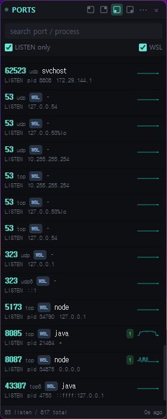
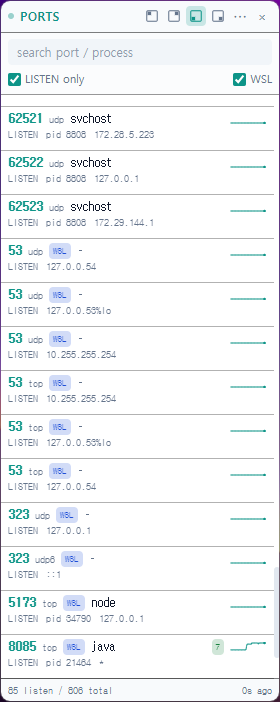

# Port Monitor

세로 사이드바 형태로 상주하는 크로스플랫폼 실시간 포트 모니터. Windows · macOS · Linux (+ WSL).

<p align="center">
  
  
</p>

## 주요 기술

- Electron 30, React 18, TypeScript, Vite
- Tailwind CSS (CSS 변수 테마), zustand, react-window
- electron-builder (NSIS · dmg · AppImage · deb)
- 플랫폼별 스캐너: `/proc/net/tcp` (Linux) · `Get-NetTCPConnection` (Windows) · `wsl.exe → ss` (WSL) · `lsof` (macOS)

## 단축키

| 동작 | 키 |
|---|---|
| 창 토글 (전역) | `Ctrl/Cmd+Shift+P` |
| 설정 메뉴 닫기 | `Esc` |

## 배포

### 개발 실행

```bash
npm install
npm run electron:dev
```

### 현재 OS용 빌드

```bash
npm run electron:build
```

산출물: `release/`

### Windows

Windows 또는 WSL에서:

```bash
npm run electron:build:win
```

WSL에서 크로스빌드 시 최초 1회 Wine 32-bit 설정:

```bash
sudo dpkg --add-architecture i386
sudo apt update && sudo apt install -y wine wine32:i386
WINEPREFIX=$HOME/.wine WINEARCH=win32 wineboot -u
```

산출물: `release/Port Monitor-Setup-x.y.z.exe` (NSIS 인스톨러)

### macOS

**반드시 macOS 호스트에서**:

```bash
npm run electron:build:mac
```

산출물: `release/Port Monitor-x.y.z-{x64,arm64}.dmg`

공개 배포용 서명/노터라이제이션:

```bash
export APPLE_ID="..."
export APPLE_APP_SPECIFIC_PASSWORD="..."
export APPLE_TEAM_ID="..."
export CSC_LINK="path/to/DeveloperID.p12"
export CSC_KEY_PASSWORD="..."
npm run electron:build:mac
```

### Linux

```bash
npm run electron:build:linux
```

산출물:
- `release/Port Monitor-x.y.z-x86_64.AppImage`
- `release/port-monitor_x.y.z_amd64.deb`
